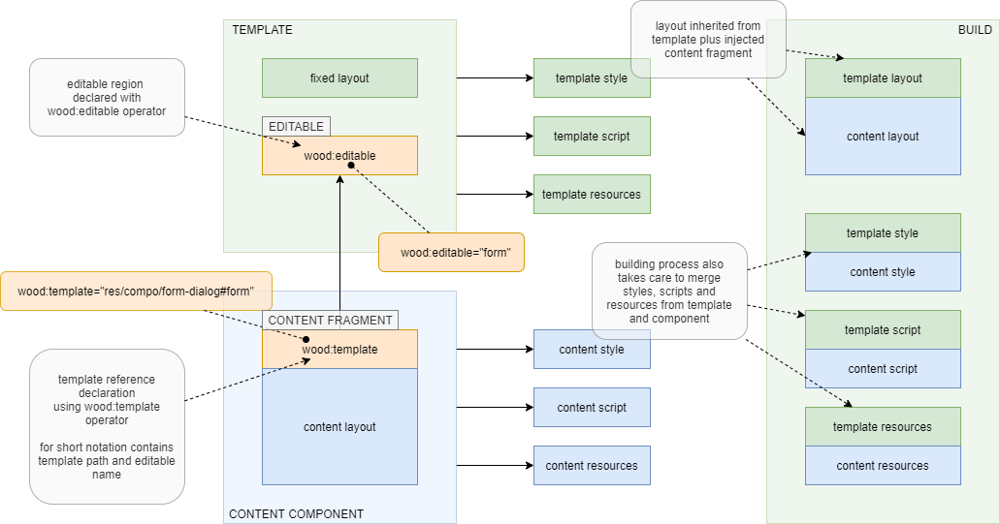

## Inheritance

WOOD emulates OOP inheritance using templates with editable regions. A template has a fixed region -  also known as template chrome, and one or more editable regions. A content component that extends the template provides the content fragment that replaces editable element. A content component is a component specifically crafted to provide content for a template and content fragment is a tree of HTML elements that has a single root element and one or many content elements.


After build we have a layout that inherits chrome from template plus injected content fragment. Building process also takes care to merge styles, scripts and resources from template and component.


### Template

A template is a component with some fixed layout and empty placeholders that need to be replaced by custom layout. These empty placeholders are named editable regions or, for short, editables.

An editable is an element with `wood:editable` operator that contains the named of the editable region, unique at template level.

Editable element define an insertion point where content fragment will be injected by building tool. Content fragment will literally replace editable element from template. In resulting component, template styles are included before content style so that content component can overwrite template styles.


### Content Fragment

Editable regions from template are actually empty elements which need to be replaced with custom content. For that we use content fragments, provided by the components extending the template.

At the source code level, content fragment is a tree of HTML elements. The fragment has a single root element and one or many content elements, that are direct children of the root element. Root element has `wood:template` operator to declare the path to the template; this path is always relative to project root. Content element has `wood:content` operator that declare the editable region name, where it should be injected. Content element and its descendants replaces the template editable element, with attributes merge.


If there is only one content element - see (2), there is the option to use a shorter notation: concatenate both template path and editable name in the `wood:template` operator from content fragment root. Uses hash (#) as separator.


### Standalone vs Inline

So far we considered only standalone templating - see section (1) from below diagram; only one template and one content component are allowed in this relationship. Also content component has a single content fragment that is the root of the content document. It is true that content fragment can have multiple content elements but still a single content fragment. In this design only template can have chrome.


In `standalone templating` content fragments are injected into the template document, which is the building process artifact. There is also the option to inject the resolved template inline into the component; in this case the component document is the build artifact. This new design is named `inline templating` - see section (2) from diagram.

Inline templating design define a relationship between one component and a number - possible more than a single one, of templates. All components and templates can have chrome. Component can contain any number of content fragments and is legal to have many content fragments extending the same template.

#### Standalone

Template layout file.

`res/template/template.htm`

```html
<template>
    <chrome></chrome>
    <div w:editable="EDITABLE A"></div>
    <div w:editable="EDITABLE B"></div>
</template>
```

Content layout file.

`res/content-fragment/content-fragment.htm`

```html
<content-fragment w:template="res/template">
	<div w:content="EDITABLE A">
    	...
	</div>
	<div w:content="EDITABLE B">
    	...
	</div>
</content-fragment>
```

#### Inline

`res/template-a/template-a.htm`

```html
<template>
    <chrome></chrome>
    <div w:editable="EDITABLE A"></div>
</template>
```

`res/template-b/template-b.htm`

```html
<template>
    <chrome></chrome>
    <div w:editable="EDITABLE B"></div>
</template>
```

`res/component/component.htm`

```html
<component>
    <chrome></chrome>
	<content-fragment w:template="res/template-a">
		<div w:content="EDITABLE A">...</div>
    </content-fragment>
	<content-fragment w:template="res/template-b">
		<div w:content="EDITABLE B">...</div>
    </content-fragment>
</component>
```


### Relationship Description

Below diagram describe component inheritance via template mechanism. For brevity only one editable is figured in diagram but a template may have a not limited number of editable elements. A component that uses a template but does not define content for all template editable elements become a template on its turn. This way one can create an inheritance chain of  arbitrary length; a sub-template can define content for any super-template from hierarchy and can include its own editable elements.





Note that multiple inheritance is not supported. A content component may define content for multiple editable elements but all should belong to the same template.

```
    grand-parent.htm
    <body>   														
        <h1>Grand Parent</h1> 
        <section wood:editable="section"></section>
    </body> 
```

```
    parent.htm        
    <section wood:template="grand-parent#section">                    
        <h2>Parent</h2>                       
        <div wood:editable="paragraph"></div>
    </section>
```

```
    child.htm
    <div wood:template="parent#paragraph">
        <h3>Child</h3>
    </div>
```

In above snippet we have three component layout files: child, parent and grand-parent. Child define content for 'paragraph' editable section from parent. Parent define content for 'section' editable element from grand parent. Resulted document is below.

```
    <body>
        <h1>Grand Parent</h1>
        <section>
            <h2>Parent</h2>
            <div>
                <h3>Child</h3>
            </div>
        </section>
    </body>                                                                            
```

Child <div> and its descendants replaces parent <div>. Parent <section> and its descendants - that now include already inserted child <div>, replaces grand-parent <section>.


### Template Parameters

Beside editable regions a template may contain parameter references for template customization - see `@param/title` . For example, a template for a dialog box may have a title and every dialog, based on this dialog template, can have its own title value.

```
    template/dialog/dialog.htm
    <div class="dialog">
        <h2 class="title">@param/title</h2>
        <div class="box-close"></div>
        ...
        <div wood:editable="body"></div>
        ...
    </div>
```
```
    dialog/user/user.htm
    <div wood:template="template/dialog#body" wood:param="title:Edit User">
        <form>
        ...
        </form>
    </div>
```

Generated user dialog layout will look like below sample code. Body editable is replaces by provided `form` and title updated from parameter.

```
    <div class="dialog">
        <h2 class="title">Edit User</h2>
        <div class="box-close"></div>
        ...
        <div>
            <form>
            ...
            </form>
        </div>
        ...
    </div>
```


### Case Study

Lets consider three user dialogs for user creation and edit and password change. All have basically the same look but differ by form fields, dialog caption and submit button label.


Is obvious we will have a template and three content components. Template `res/compo/form-dialog` has an editable form element. Content components, `res/user/create-dialog`, `res/user/edit-dialog` and `res/user/password-dialog` implements specific form fields. Content components use short notation `wood:template="res/compo/form-dialog#form"` to identify template and its editable region.


To customize dialog caption and submit button label there are `wood:param` operators. For example, on user creation dialog it is `wood:param="caption:CREATE USER;btn:Create"`. Parameters names need to match those declared on template: `@param\caption`, respective `@param\btn`. For other two dialogs parameters handling is similar.